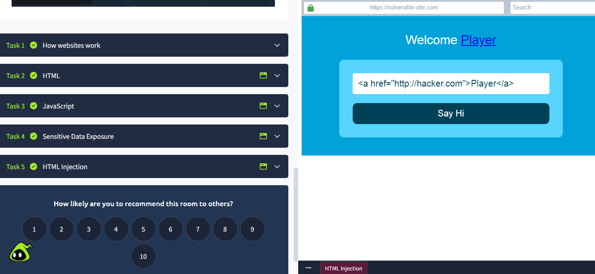

# How Websites Work

This repository documents fundamental concepts related to how websites function, with a strong focus on **client-side behavior** and **input handling vulnerabilities**.

---

## Topics Covered

- How websites handle user input
- HTML structure and rendering
- JavaScript interaction with web pages
- Exposure of sensitive data
- HTML Injection vulnerabilities
- Basic security implications of improper input validation

---

## HTML Injection Demonstration

The screenshot below shows a practical example where user-controlled input is injected directly into the page, resulting in a malicious HTML link being rendered.

### Screenshot

---

## Why HTML Injection Matters

HTML Injection can allow attackers to:
- Modify page content
- Inject malicious links
- Phish users
- Act as a stepping stone for Cross-Site Scripting (XSS)

This vulnerability usually occurs when applications fail to properly validate or sanitize user input before rendering it in the browser.

---

## Learning Platform

Based on the **TryHackMe – How Websites Work** room.

---

## Status

✅ Module completed  
📚 Building strong foundations in web security concepts

---

## Disclaimer

This repository is for **educational purposes only**.  
All examples are performed in controlled lab environments.
